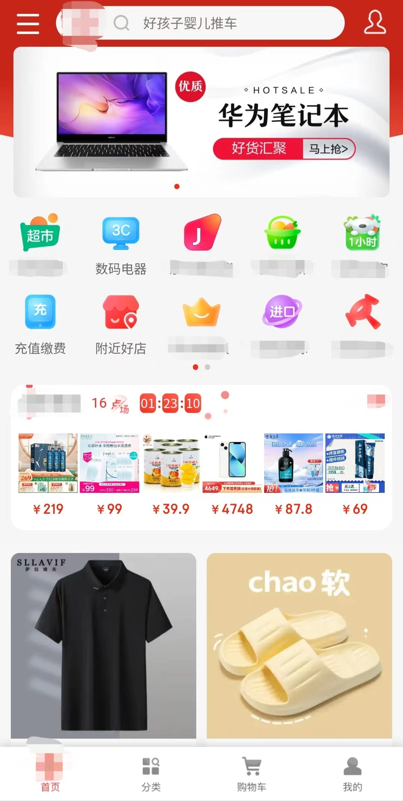
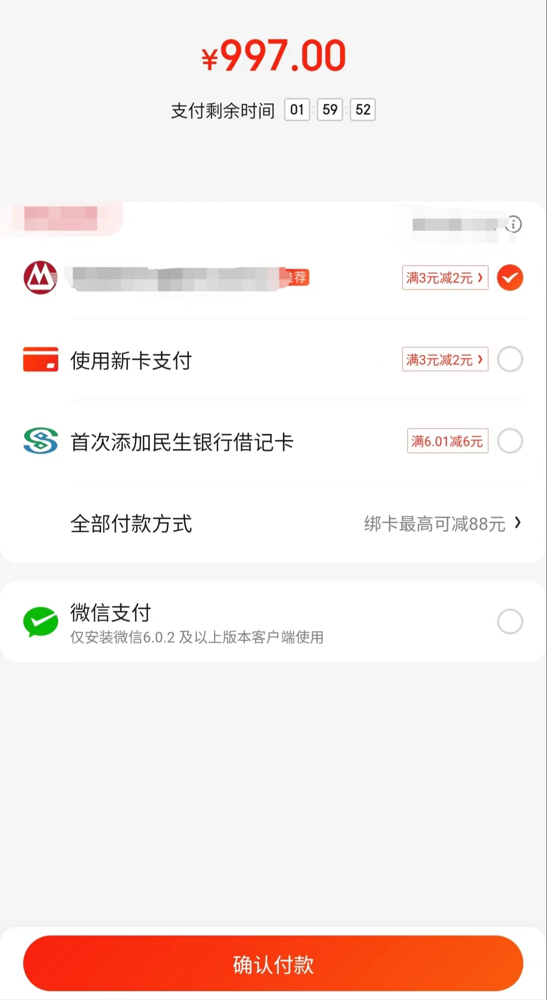
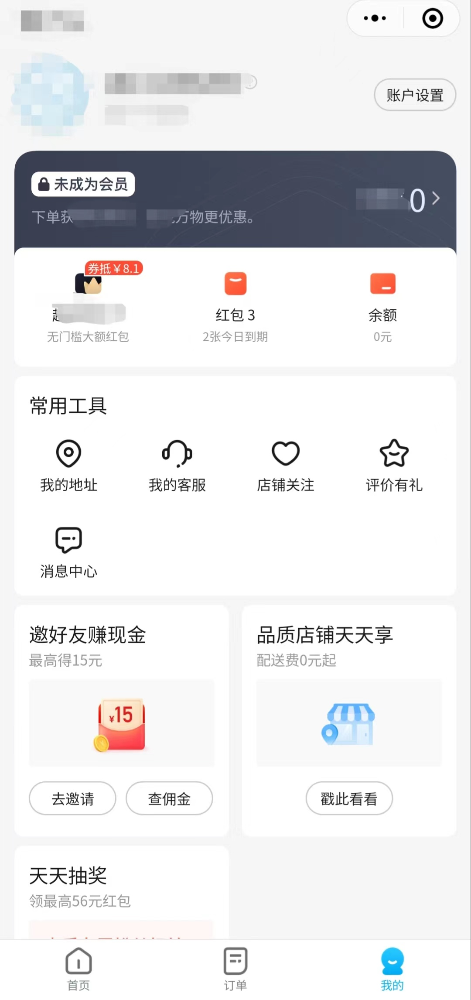
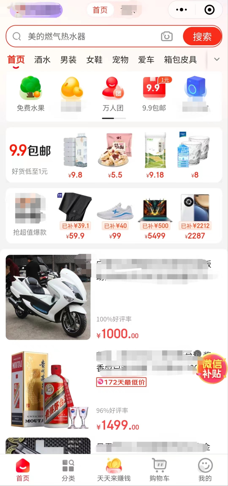
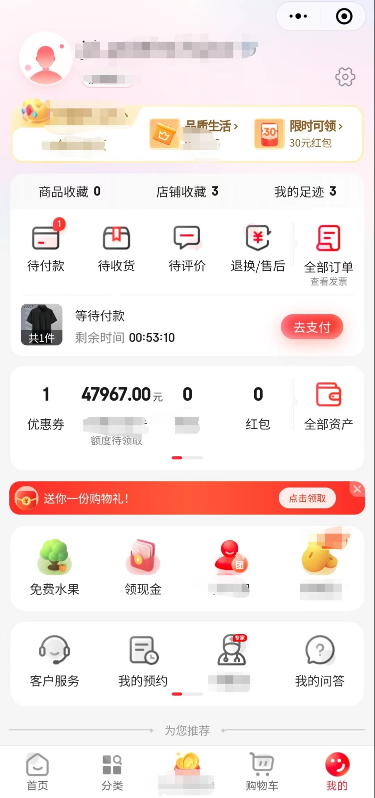
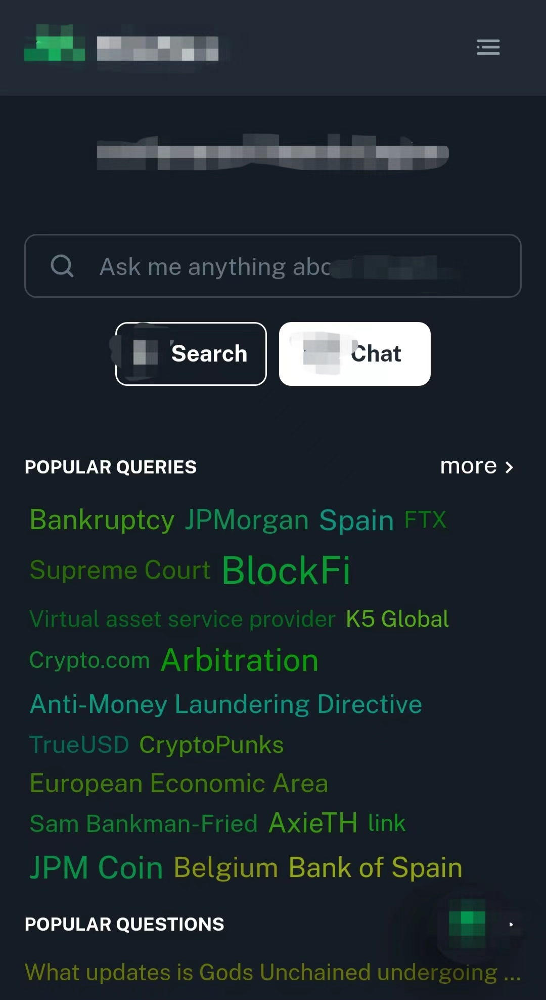
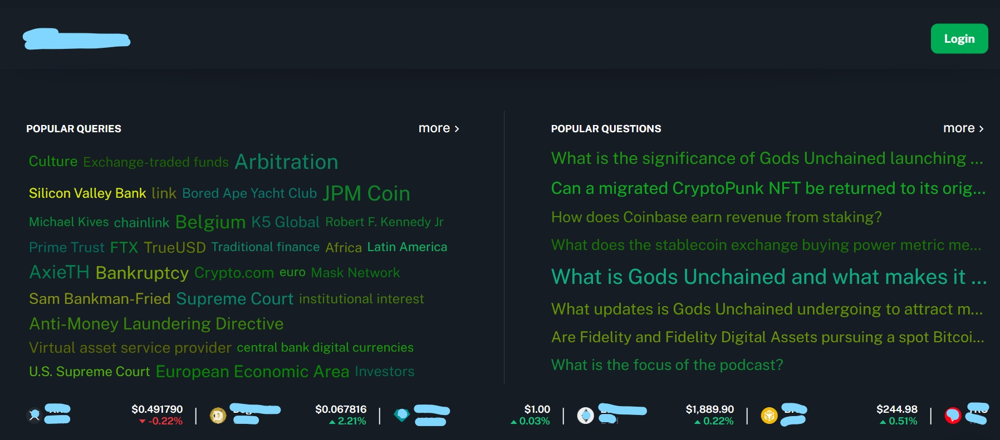

<h1> Hey! Nice to see you.</h1>

hi, i'm Abel, a passionate full stack web developer and a freelance software engineer, with over seven years of experience building websites and web applications using JavaScript,HTML/CSS,node and modern frameworks to deliver exceptional customer experiences.Spearheaded redesign of company’s several websites and mobile webapps.Adept at contributing to a highly collabrative work environment,finding solutions,and determining customer satisfaction.I’m skilled at problem-solving and communication, with the ability to work effectively in both individual and team settings. Seeking a challenging and rewarding opportunity to leverage my skills and experience to drive business growth and success.

### 🎓About me:

- I love writing code, and building websites
- collaborated with designers and stakeholders to deliver successful projects
- excel at working in a fast-paced, agile environment
- continue learning and stay up-to-date with the latest technologies

 
 

### 📝Languages and Tools:  

   
  
  
  
   
   
  
  
  
  
   
   
   
   
   
   
  
    
    
  
  
  

 
 
 

### 💡 Projects with My Work:
<b>Notice</b>:these below were some part of my projects which can't show code,because them were related to commercial business.you can watch my reps about my coding style.
 
 - mobile web App designed by React.js

  
  &nbsp;&nbsp;&nbsp;
  

 - minprogram App designed by minprogram native syntax
   

  
  &nbsp;&nbsp;&nbsp;
  
  &nbsp;&nbsp;&nbsp;
  
  &nbsp;&nbsp;&nbsp;
  

- responsive App including pc and mobile using reactjs\nextjs\taiwindcss
   

  
  &nbsp;&nbsp;&nbsp;
  

### 📫 Contact Me

 <h4>💼 any work? do reach me ✉️ [Email](mailto:zhanqiangli73@gmail.com)</h4>
 <h4>💬 ask me about anything, i am happy to help;</h4>
